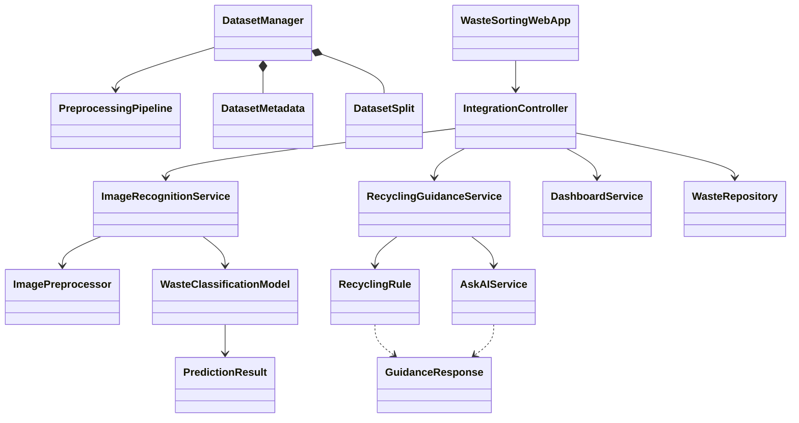
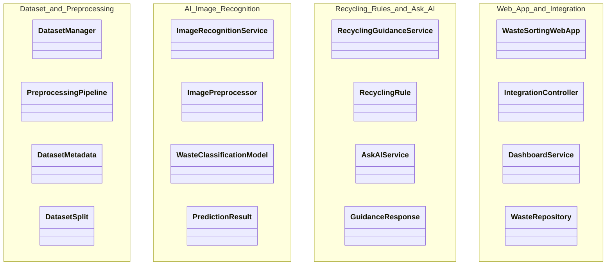

# EcoSort AI UML diagrams

These diagrams use the same class names as the capstone presentation and implementation.

## Complete system

```mermaid
classDiagram
DatasetManager --> PreprocessingPipeline
DatasetManager *-- DatasetMetadata
DatasetManager *-- DatasetSplit
ImageRecognitionService --> ImagePreprocessor
ImageRecognitionService --> WasteClassificationModel
WasteClassificationModel --> PredictionResult
RecyclingGuidanceService --> RecyclingRule
RecyclingGuidanceService --> AskAIService
RecyclingRule ..> GuidanceResponse
AskAIService ..> GuidanceResponse
WasteSortingWebApp --> IntegrationController
IntegrationController --> ImageRecognitionService
IntegrationController --> RecyclingGuidanceService
IntegrationController --> DashboardService
IntegrationController --> WasteRepository
```

## Classes by subsystem

```mermaid
classDiagram
namespace Dataset_and_Preprocessing {
 class DatasetManager
 class PreprocessingPipeline
 class DatasetMetadata
 class DatasetSplit
}
namespace AI_Image_Recognition {
 class ImageRecognitionService
 class ImagePreprocessor
 class WasteClassificationModel
 class PredictionResult
}
namespace Recycling_Rules_and_Ask_AI {
 class RecyclingGuidanceService
 class RecyclingRule
 class AskAIService
 class GuidanceResponse
}
namespace Web_App_and_Integration {
 class WasteSortingWebApp
 class IntegrationController
 class DashboardService
 class WasteRepository
}
```
